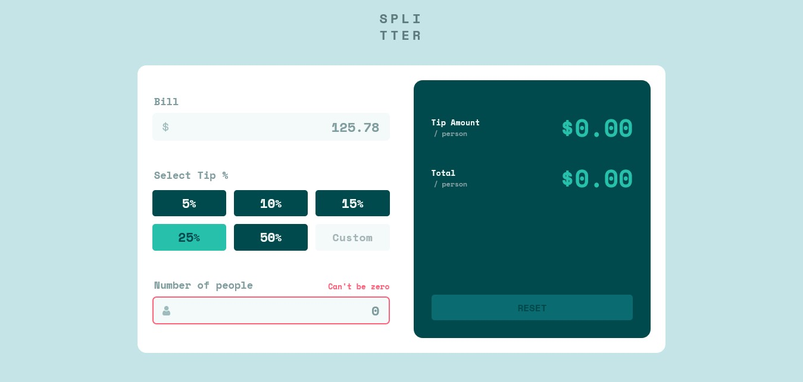

## Splitter (Tip Calculator)

# Frontend Mentor - Tip calculator app solution

This is a solution to the [Tip calculator app challenge on Frontend Mentor](https://www.frontendmentor.io/challenges/tip-calculator-app-ugJNGbJUX). Frontend Mentor challenges help you improve your coding skills by building realistic projects.

## Table of contents

- [Overview](#overview)
  - [The challenge](#the-challenge)
  - [My solution screenshot](#screenshot)
  - [Links: Live and Solution](#links)
- [My process](#my-process)
  - [Built with](#built-with)
  - [What I learned](#what-i-learned)
  - [Continued development](#continued-development)
  - [Useful resources](#useful-resources)
- [Author](#author)
- [Acknowledgments](#acknowledgments)

## Overview

The Splitter tip calculator's functionality is modelled on equal tip distribution among a group
of tip-eligible people/staffs/workers/employees. The Splitter calculates by splitting the total aggregate collection of money/bill at specific X percents for N number of person.

```To calculate tip per person, I use this formulae:
tip = bill * X/100N
```

```To calculate the paid amount per person, I use this formulae:
Amount = bill * (1/N + X/100N)
```

### The challenge

Users should be able to:

- View the optimal layout for the app depending on their device's screen size
- See hover states for all interactive elements on the page
- Calculate the correct tip and total cost of the bill per person

### Screenshot



### Links

- Solution URL: [My solution](https://www.frontendmentor.io/solutions/tip-calculator-app-solution-VcStNBrfzU)
- Live Site URL: [Splitter](https://splittr-tip-calculator.netlify.app/)

## My process

I break the entire webpage into small component views/UIs and leverage on the concept of
SEPARATION OF CONCERNS in which each component manages its own logic, data and aesthetic codes.

Splitter UI is broken into the following components:

- Button
- InputBox
- Display

I made Button and InputBox components **generic or reusable** components because they are the
major building blocks for the entire webpage.

### Built with

- Semantic HTML5 markup
- CSS custom properties
- Flexbox
- CSS Grid
- Mobile-first workflow
- [React](https://reactjs.org/) - JS library

### What I learned

While working on this project, I get to know the nuances between **rem** and **em** relative units
and why **em** unit is acceptable unit over other units (px, rem) in writing media query for different screen sizes.

Making a global declaration of font-size on html tag, like: `html {font-size: 62.5%}` doesn't change intrinsic value **1em or 1rem evaluates to when use for screen sizes or dimensions in media query, on my system it evaluates to 16px**.

So I used to think setting `html {font-size: 62.5%}` which is equivalent of 10px would make **1em equals 10px** even though **1rem equals 10px** is valid with that global declaration.

So, to calculate equivalent of 300px for example in **em**, I divided 300px by 16px === 18.75em.

Important concept worth mentioning in providing solution to this challenge are:

- React state and state management
- Derived state
- Lifting state

```media query
@media screen and (width <= 18.75em) {
  /*******************************
      300/16 === 18.75em
  ********************************/
  .display {
    CSS rules
  }
}
```

Other CSS code I find interesting in regard to this project:

```CSS Grid
.display {
  grid-template-columns: repeat(auto-fit, minmax(10rem, 1fr));
}
```

```CSS pseudo-class
.tip-options input:focus {
  border: 2px solid var(--color-primary);
}
```

```CSS pseudo-element
button .percent::after {
  content: '%';
  font-size: 1.8rem;
}
```

```html
<section>Delineate section of html block</section>
```

```js Destructuring Assignment, default export and children props (Reusable Component)
import React from "react";

function Button({ className, textColor, bgColor, children, onClick }) {
  const style = { color: textColor, backgroundColor: bgColor };
  return (
    <button style={style} className={className} onClick={onClick}>
      {children}
    </button>
  );
}

export default Button;
```

### Continued development

Areas to focus on in future projects are:

- React state management
- React Hooks e.g useReducer, useContent, useRef, useEffect etc
- Writing reusable components

### Useful resources

- [Ultimate-react course by JONAS SCHMEDTMANN](https://www.udemy.com/course/the-ultimate-react-course/) - This gives me better understanding of state lifting, derived state and state management.

- [PX, EM or REM Media queries](https://zellwk.com/blog/media-query-units/) - This helps me understand better why **EM** is favourable accepted over other units in writing media query.

-[Basic concepts of flexbox](https://developer.mozilla.org/en-US/docs/Web/CSS/CSS_flexible_box_layout/Basic_concepts_of_flexbox) - This gives best explanations why my boxes behave the way they are with this declaration `.block-or-inline {display: flex}`.

-[Complete guide to CSS Grid](https://css-tricks.com/snippets/css/complete-guide-grid/)

## Author

- Frontend Mentor - [@files](https://www.frontendmentor.io/profile/files)
- Twitter - [@jsdev\_](https://www.twitter.com/jsdev_)

## Acknowledgments

A very big shout out to [Jonas Schmedtmann](https://www.twitter.com/jonasschmedtmann). A great online tutor with simple explanation at its best.
